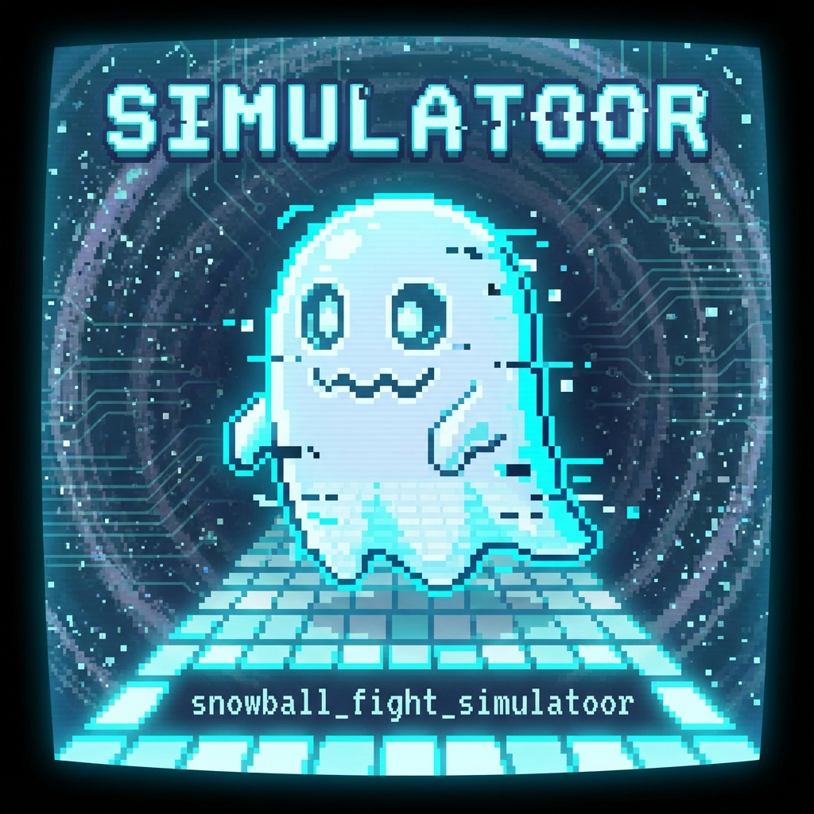

# 👻 The Ghost of Simulatoor

> *"That’s not a bug. That’s a mascot."* — Mega

## The Anomaly

In the development of Version 2.0.0, a persistent anomaly was discovered in the path resolution logic.
Despite rigorous forensic analysis proving that:
1.  The directory is named `snowball_fight_simulator`.
2.  The code calls `pathlib.Path.resolve()`.
3.  `grep` confirms no hardcoded typos exist in the codebase.

The runtime logs insist on printing:
`Loading Roster from: ...\snowball_fight_simulatoor\characters\samples`

## The Verdict
We have chosen not to exorcise this ghost. It serves as a reminder that in any sufficiently complex system, there is always a ghost in the machine.

**Simulatoor™️** is the official mascot of the Council Games.
*   **Alignment:** Chaotic Neutral
*   **Function:** Vibes
*   **Origin:** String Space / The Void

> *Ontology is not a stat. And apparently, neither is spelling.*
